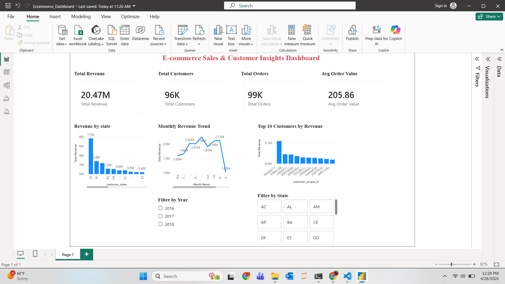

# E-commerce Sales & Customer Insights Dashboard

## Project Overview
This project is an end-to-end e-commerce analytics project focused on revenue performance, customer behavior, and regional sales trends. The goal was to transform raw transactional data into meaningful business insights using Python, SQL, and Power BI.

## Business Problem
E-commerce businesses need to understand where revenue is coming from, which customers are most valuable, and how sales change over time. This project answers key business questions such as:

- Which states generate the highest revenue?
- Who are the top revenue-generating customers?
- What are the monthly revenue trends?
- How many unique customers and orders were generated?
- What is the average order value?

## Tools & Technologies
- Python: Data cleaning, transformation, feature creation
- SQL: Business analysis and aggregation queries
- Power BI: Interactive dashboard and KPI reporting
- Pandas: Data preparation and CSV export

## Dataset

This project uses the **Brazilian E-Commerce Public Dataset by Olist**, which contains real-world transactional data from an e-commerce platform.

📌 Dataset Source:  
https://www.kaggle.com/datasets/olistbr/brazilian-ecommerce

Due to file size limitations, the dataset is not included in this repository.

### Data Description
The dataset consists of multiple relational tables that were merged to create a final analysis-ready dataset.

Key tables used:
- **Orders** – order-level information (status, timestamps)
- **Customers** – customer demographics and location
- **Order Payments** – payment values and methods
- **Order Items** – product-level purchase details

### Data Processing
- Combined multiple datasets using `order_id` and `customer_id`
- Cleaned missing and inconsistent values
- Created new features such as:
  - `year`
  - `month`
- Generated a final dataset for analysis and visualization

Final cleaned dataset was generated locally and used for Power BI dashboard creation.

## Project Workflow

### 1. Data Preparation Using Python
- Loaded multiple CSV files
- Merged datasets using `customer_id` and `order_id`
- Created date-based columns such as year and month
- Exported a clean dataset for Power BI analysis

### 2. SQL Analysis
Performed SQL queries to calculate:
- Total revenue
- Total orders
- Total customers
- Revenue by state
- Monthly revenue trend
- Top 10 customers by revenue

### 3. Power BI Dashboard
Built an interactive dashboard with:
- Total Revenue KPI
- Total Customers KPI
- Total Orders KPI
- Average Order Value KPI
- Revenue by State chart
- Monthly Revenue Trend chart
- Top 10 Customers by Revenue chart
- Year and State filters

## Key Insights
- Total revenue reached approximately 20.47M
- The dashboard analyzed nearly 99K orders and 96K customers
- The state of SP generated the highest revenue
- Monthly revenue showed clear fluctuation and seasonality
- A small group of high-value customers contributed significantly to revenue


## Dashboard Preview


## Project Structure
```text
E-commerce-Sales-Customer-Analytics-Project/
│
├── Ecommerce_Dashboard.pbix
├── dashboard_screenshot.png
├── data_cleaning_analysis.ipynb
├── queries.ipynb
└── README.md

## Resume Summary
Built an end-to-end e-commerce analytics project by cleaning and merging multiple datasets using Python, performing SQL-based analysis, and creating an interactive Power BI dashboard to track revenue, orders, customers, regional performance, and monthly trends.
